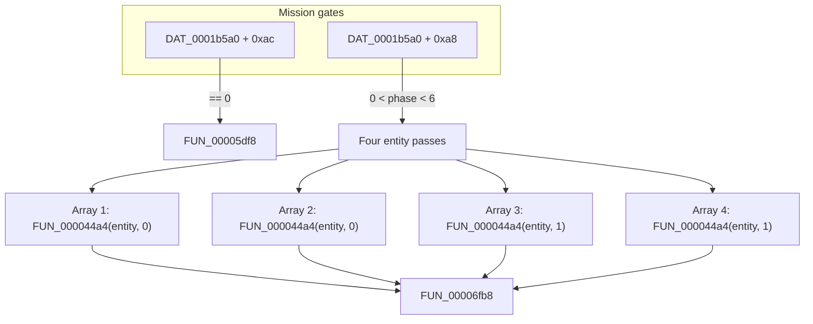
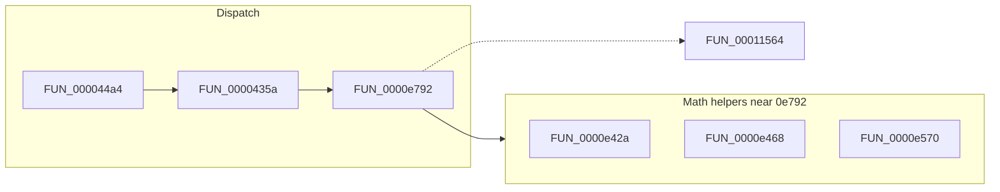
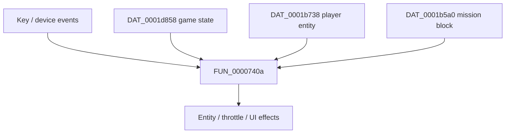
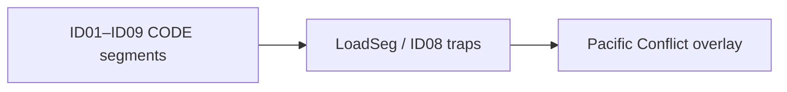

# Subsystem map (Hellcats decompilation ↔ Godot)

Tags: **[RECONSTRUCTED]** / **[INFERRED]** / **[UNKNOWN]** / **[DEFERRED]**.

**Purpose:** One-page mental model of how the **original sim** hangs together and where **Godot** work lands. For symbol-level detail see `docs/IMPORT_STATUS.md` and the per-topic contracts linked below.

**Primary source file:** `Pacific Conflict.c` (Ghidra export). **Segment/runtime:** `ID01.c`–`ID09.c` (see `docs/LOADER_CHAIN.md`).

---

## 1) High-level flow (main sim tick)

**[RECONSTRUCTED]** The main loop is anchored on **FUN_000044e8** (`docs/contracts/tick_FUN_000044e8_contract.md`):

**[RECONSTRUCTED]** **FUN_000044a4** calls **FUN_0000435a** then optional flag updates (`docs/contracts/tick_FUN_000044e8_contract.md`).

**[RECONSTRUCTED]** Per-entity simulation includes **FUN_0000e792** (large; `docs/contracts/flight_FUN_0000e792_contract.md`).

**Godot:** **`hellcats/core/sim_core.gd`** mirrors pass order and **`param_2`**; **Mission-1** gameplay loop is **`PlayerAircraft` + `FlightModelMvp`** **[INFERRED]** unless you explicitly drive SimCore.

---

## 2) Per-entity update (conceptual)

**[INFERRED]** **FUN_00011564** is used in many places (entity, AI, effects); full consumption graph is **[UNKNOWN]** without a dedicated pass.

**Godot:** **`flight_model_mvp.gd`**, **`flight_math.gd`**, **`sim_core.gd`** (partial).

---

## 3) Input path (conceptual)

**Godot:** **`player_input_map.gd`** — **`docs/contracts/input_godot_contract.md`**, **`docs/briefs/input_FUN_0000740a_brief.md`**.

---

## 4) Mission state bridge (MVP)

**[RECONSTRUCTED]** Mission block **`DAT_0001b5a0`** fields **`+0xa8`** (phase) and **`+0xac`** (flag) gate **FUN_000044e8**’s middle section.

**Godot:** **`MissionController`** exposes **`mission_phase_a8`** / **`mission_flag_ac`** and **`get_mission_sim_bridge_state()`** — **`docs/contracts/mission_state_DAT_contract.md`**.

---

## 5) RNG (two layers)

| Layer | **[RECONSTRUCTED]** location | Notes |
|-------|------------------------------|--------|
| Segment LCG | **ID05.c** `FUN_00000728` style (`* 0x41c64e6d + 0x3039`) | Matches **`Rng68k`** / docs. |
| In-overlay RNG | **FUN_00011564** (`Pacific Conflict.c`) | Many callers; order-sensitive for replay. |

See **`IMPORT_STATUS.md`** §F and **`ROADMAP.md`** Phase A.

---

## 6) Camera

**FUN_0000739a** sits on the tick/render boundary **[RECONSTRUCTED]** (multiple call sites). **Godot** uses an authored chase camera on **`PlayerAircraft`** **[INFERRED]** — not a direct port.

---

## 7) ID segments vs Pacific Conflict

**[INFERRED]** Most **game-identifiable** `FUN_*` for parity work live in **Pacific Conflict.c**; **ID*** files are **runtime, RNG, loader, helpers** unless proven otherwise (`docs/LOADER_CHAIN.md`).

---

## Related documents

| Document | Role |
|----------|------|
| `docs/IMPORT_STATUS.md` | Row-level import status |
| `docs/contracts/tick_FUN_000044e8_contract.md` | Tick order |
| `docs/contracts/FUN_0000435a_contract.md` | **param_2** / **0x02** branch |
| `docs/contracts/flight_FUN_0000e792_contract.md` | Entity update slice |
| `docs/contracts/input_godot_contract.md` | Godot input mapping |
| `docs/contracts/mission_state_DAT_contract.md` | Mission bridge |
| `docs/STRUCTS.md` | DAT_* / offset tables |
| `docs/LOADER_CHAIN.md` | ID00–ID09 and loading |

---

## Update log

| Date | Change |
|------|--------|
| 2026-04-08 | Initial **SUBSYSTEM_MAP.md**. |
